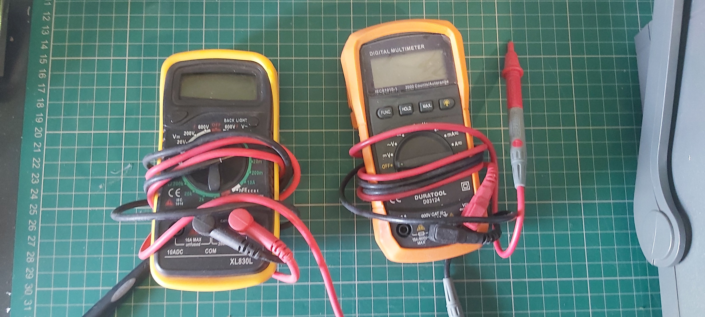

# Hand-held multimeters

We have two hand-held multimeters for testing your electronics projects.

## Duratool D03124

[Manual](./d03124Manual.pdf)

This meter is a handheld, battery operated digital multimeter (DMM) with multifunction.

This meter is designed to meet IEC61010-1 & CAT II 600V over voltage category
and double insulation.

The DC voltage ranges are 200.0mV, 2.000V, 20.00V, 200.0V and 600V.
The AC voltage ranges are 2.000V, 20.00V, 200.0V and 600V.

The resistance ranges are 200.0Ω, 2.000KΩ, 20.00KΩ, 200.0KΩ, 2.000MΩ and
20.00MΩ.

## Excel XL830L

[Manual](./xl830lManual.pdf)

The meter is a handheld 31/2 digital multimeter for measuring DC and AC voltage, DC current, Resistance, Diode and Transistor with battery operated. 
