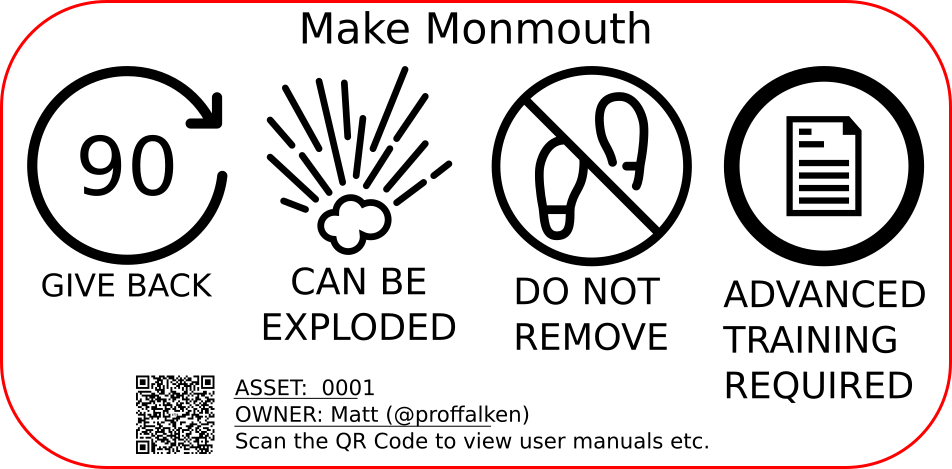
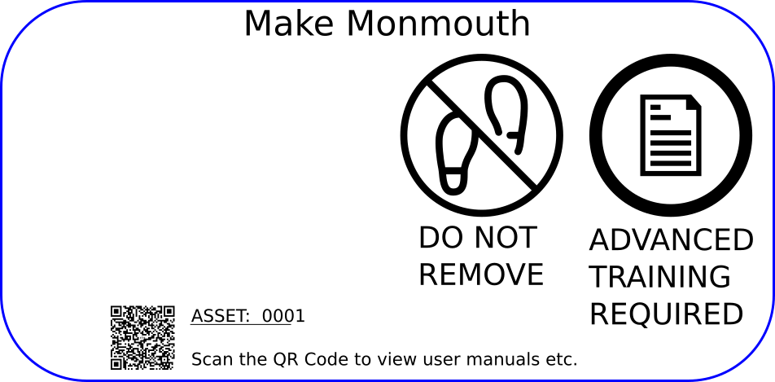

# Equipment usage

We've been incredibly grateful to all those who have lent us equipment whilst getting started, and we understand that those people will want that equipment back at some point, so we're introducing a set of icons and stickers that will be on all equipment so everyone knows what can be done with that item and how long it will be around for.

!!! note
    Anything **loaned** to the space will have a sticker with a RED border, anything **owned** by Make Monmouth will have a BLUE border.

### Assumptions

If you donate something to the space, we assume that it is to be used by everyone.

If you do not want other people to try and fix or improve that item, we can add that icon to the sticker.  By the same token, if you do not expect to get it back in fully working order, we have an icon for that as well!

### Common sense takes priority

We assume that anything in the space is to be treated with respect and only repaired/taken apart/upgraded with the consent of the owner.  The stickers indicate when this is *not* the case, however, you should always leave things as you find them unless the sticker indicates otherwise!

## How do the stickers work?

Every significant item in the space will have a sticker on it.  The sticker will clearly show:

   * Who the equipment is owned by
   * The asset number (where appropriate)
   * Indicators based on the categories below showing what can/can't be done with that item

### What do the stickers look like?

The stickers look like this:

There is a full explanation of what each of these icons mean below, however as an example this item:

  * Must be returned to the person who donated it within 90 days of their request
  * May be taken apart for "spares" or component reuse elsewhere
  * Must not be removed from the space
  * Requires advanced training/induction before use (this could be a 3D printer, sewing machine, or similar)

The QR Code has a link to the inventory system where manuals, links to suppliers' websites, and other information about the item can be found.

In contrast, a Make Monmouth owned asset will look like this:

In this case, the item:

  * Is owned by Make Monmouth, so has no need for a "Give Back" term
  * Cannot be taken apart for "spares" or component reuse elsewhere
  * Must not be removed from the space
  * Requires advanced training/induction before use (this could be a 3D printer, sewing machine, or similar)

As before, manuals, links to suppliers' websites, and other information can be found via the QR code.

!!! warning
    If you discover an item that *DOES NOT* have a sticker on it, you should assume that it is not to be taken apart 
    and that advanced training is required unless instructed otherwise by a member of the Core Team.
    
    Any item without a sticker should be reported via the [Member Portal](https://members.makemonmouth.co.uk) so we can
    create one!

### The Icons

### Give Back (GB) 

**LOAN ITEMS ONLY**

"Give Back" shows the number of days that the space has to find a replacement for the item after the owner asks for the item to be returned to them. 

Even if a replacement is not found, the item must be returned within this timeframe.

The space is *not* responsible for collection/delivery of the item, however, we will assist where we can with times/dates for collection.

### Can be exploded (CBE)

"CBE" means that equipment / consumables can be taken apart, used for spare parts, exploded, or blasted into the sun. 

!!! danger
    If an item **DOES NOT** carry "CBE" on the label, you MUST NOT attempt to take it apart in any way, shape, or form, even for maintenance
    without the written permission of either the Owner or the Core Team.

It is assumed that all items are **NOT** CBE unless the sticker says so to avoid the dismantling of things that should otherwise remain intact.

### Do Not Remove (DNR)

Anything with DNR on the label must not be removed from the space without the written permission of the owner (loan items) or the Core Team.

### Advance Training Required (ATR)

Any item with this icon on the sticker requires further induction before use.

The induction may be via online training or in person, and details of the induction process can be found by scanning the QR code on the label.

!!! danger
    Anyone found using equipment marked "ATR" without having undertaken the appropriate training will be asked to immediately stop what they are doing
    and will not be permitted to use the equipment until the training has taken place.
    
    **ANY CHARGES FOR TIME/CONSUMABLES INCURRED USING THE MACHINE WHILST UNTRAINED WILL STILL BE CHARGED TO THE USER**

### Other data

#### QR Code

The QR Code is automatically generated by the inventory and links to the item on the system.

It can be scanned by any mobile phone or table with a QR Code reader, and you will need to know your username and password for the Inventory system.

Once logged in to the inventory, you will be able to see details of the item as well as links to user-guides, vendors, and other related information.

#### Asset

This is the Asset ID.  It is automatically assigned to the item when we create it.  You don't really need to worry about this unless you are unable to
scan the QR Code.

If you can't scan the QR code for whatever reason, go to the inventory homepage and search for the asset ID on the label.  You will then be able to see
all the things that you would have seen if you had been able to scan the code.

#### Owner

Only visible on items that have been loaned to the space, this is who you need to talk to if you have a question about changing the icons currently on the sticker.

The format is `<FIRSTNAME> ( @DISCORD_USERNAME )` so if you can't find someone in the space, ping them on discord.

If you don't have a response from them within a reasonable timeframe, approach one of the Core Team and we'll get in touch with them on your behalf.

